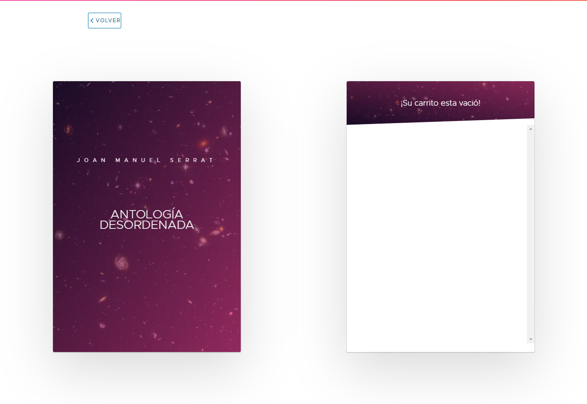

# Onebox - Proyecto de cartelera.

## Especificaciónes de versión Angular:

## Se ha añadido un servidor JSON, para simular una DB:
[//]: <> (Para iniciar servidor JSON: npm run json)

## Alerta en caso de no encontrar DB:

## Imagen del primero SPA (Cartelera - large screen:

## Imagen del primero SPA (Cartelera - medium/small screen ):

## Imagen del segundo SPA (Evento - large screen ):

## Imagen del segundo SPA (Evento - medium/small screen ):

## Imagen del ejemplo de carrito:

# Espero que os guste, y múchas gracias!
